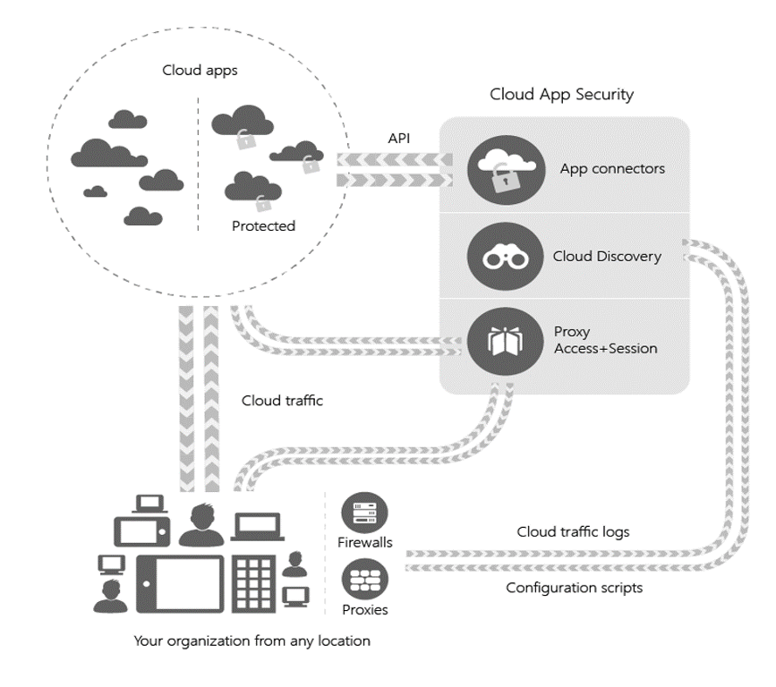
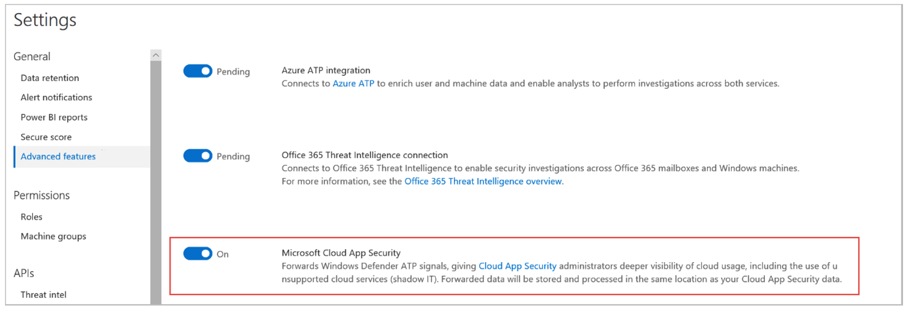
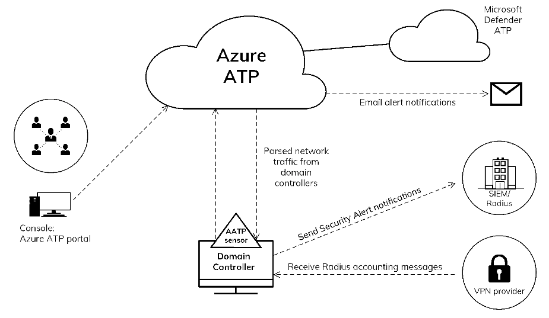

## Security

Information Technology (IT) Security refers to protection of networks, servers, intranets, data systems, data and computer systems. To protect these items, Microsoft Azure contains several security features and products which together:

* Secure the Platform – Microsoft Azure and Office 365, through their features and products to enable security in depth.
* Provide Risk Assessments – Azure Identity Protection, Azure ATP and Microsoft Defender ATP utilise analytics and machine learning to detect and flag unusual/risky behaviour.
* Provide Visibility into User Behaviour – Microsoft Cloud App Security (MCAS) provides security operations dashboards which provide visibility into the activities being undertaken within the environment.
* Control Data Exfiltration –Data Loss Prevention policies and MCAS session policies control the flow and protection of information inside and outside of the environment.

### Microsoft Cloud App Security

MCAS is part of Microsoft's Enterprise Mobility + Security (EM+S) suite of capabilities, providing CASB functionality to reduce the risk of leveraging cloud services, including those offered by Microsoft and third-party providers such as Google, Amazon and Dropbox. To manage the risks presented using cloud services, Microsoft has defined a [cloud app security framework](https://docs.microsoft.com/en-us/cloud-app-security/what-is-cloud-app-security#the-cloud-app-security-framework) which MCAS implements:

* Discover and control the use of Shadow IT – Shadow IT includes cloud services that are in use by users but not assessed and approved by security, including Software-as-a-Service (SaaS), Platform-as-a-Service (PaaS), and Infrastructure-as-a-Service (IaaS) offerings. To protect users and their data these services must be identified so that their risk can be determined, and management controls can be implemented. MCAS enables administrators to assess an extensive library of apps against a wide range of risks.
* Protect your sensitive information anywhere in the cloud – Once data is uploaded to a cloud service it is harder to control and manage compared to traditional on-premises storage. MCAS enables controls to be applied to data regardless of where it is stored leveraging automated processes and inbuilt policies to both classify and protect information.
* Protect against cyberthreats and anomalies – Due to the public nature of cloud apps they are exposed to potential malicious activity from external actors. MCAS monitors both user behaviour and app activity to identity anomalies and perform automatic remediation to ensure the confidentiality of data stored in the cloud. This includes identifying indications that a user's account credentials have been compromised.
* Assess the compliance of your cloud apps – Performing security assessments of cloud apps and services is both complex and expensive. MCAS provides an overview of the industry and regulatory standards that each identified cloud app has been assessed against to simplify the approval process.

#### Product Architecture

The architecture of MCAS includes several integrated components to address each of the cloud app security framework requirements. The components include log collection and analysis capabilities to detect cloud apps, Application Programming Interface (API) connectors to interface with and control cloud app activity, and reserve proxy capability to enforce conditional access app control policies for authentication to cloud apps.

An overview of these components and how they combine in MCAS is illustrated below in Figure 5. Figure reproduced from [https://docs.microsoft.com/en-us/cloud-app-security/what-is-cloud-app-security#architecture](https://docs.microsoft.com/en-us/cloud-app-security/what-is-cloud-app-security#architecture)

Further details including configuration of each of these components is presented later in this document.

#### Data Location

At the time of writing MCAS is hosted from Azure data centres in the United States (US) and Europe ([https://docs.microsoft.com/en-us/cloud-app-security/cas-compliance-trust#data-location](https://docs.microsoft.com/en-us/cloud-app-security/cas-compliance-trust#data-location)). An MCAS tenant account is automatically created in the closest 'Geo'. For Azure tenants located in Australia, MCAS will use the US Geo.

#### Data Retention

The data retention period for information stored within MCAS varies depending on the specific type of data.  The [four data types](https://docs.microsoft.com/en-us/cloud-app-security/cas-compliance-trust#data-retention) and their respective periods are listed below:

* Activity log – 180 days
* Discovery data – 90 days
* Alerts – 180 days
* Governance log – 120 days

Note, all user activity and security alert information can be exported from MCAS in Comma-Separated Values (CSV) format if longer data retention is required.

#### Administration

MCAS leverages Azure Active Directory (Azure AD) to provide Role-Based Access Control (RBAC) for administration via the web portal. By default, only the Global Administrator and Security Administrator roles have full access to MCAS. Other standard Azure AD roles that have at least read-only access to the portal include Compliance Administrator, Compliance Data Administrator, Security Operator, Security Reader, and Global Reader. 

In addition to the standard Azure AD roles, MCAS also has its own service-specific roles that provide finer grained RBAC [https://docs.microsoft.com/en-us/cloud-app-security/manage-admins](https://docs.microsoft.com/en-us/cloud-app-security/manage-admins). If required, Global and Security Administrators can also grant access to specific users within the MCAS portal.

### MCAS - Cloud Discovery

The MCAS Cloud Discovery design decisions can be found below. MCAS Cloud Discovery components are made up of Log Collectors, Microsoft Defender ATP Integration, Cloud Discovery Enrichment, User Data Anonymisation, Custom Apps and App Filters & Queries.

The cloud discovery component of MCAS enables the detection of cloud apps by analysing logs that are uploaded to it.

There are two types of cloud discovery reports that are generated by MCAS, depending on the specific log source:

* Snapshot reports – generated by manually uploading a log export from a proxy or firewall device, provides on demand analysis at the time the log is uploaded.
* Continuous reports – leverage native first and third-party integrations to provide ongoing data ingest and analysis without the need for user interaction.

Continuous reports can be generated a few ways such as configuring one or more of the following [automated log upload capabilities](https://docs.microsoft.com/en-us/cloud-app-security/set-up-cloud-discovery):

* Log collector – centralisation of logs from one or more proxy or firewall devices to a Docker-powered collector using Syslog and/or File Transfer Protocol (FTP).
* Microsoft Defender ATP integration – native integration with Defender ATP logs directly from onboarded endpoint devices running, regardless of whether they connect to cloud services via a managed gateway or directly via the internet.

MCAS supports a wide range of [popular proxy and firewall vendors and products](https://docs.microsoft.com/en-us/cloud-app-security/set-up-cloud-discovery#supported-firewalls-and-proxies-) for both snapshot and continuous reports (via log collectors)  . A custom parser can also be configured for unsupported devices allowing manual attribute mapping.

Once a cloud app has been discovered and its usage reviewed it can be either sanctioned (approved) or unsanctioned (prohibited) via the Discovered Apps tab. Tagging a cloud app as unsanctioned does not block access directly but allows for the generation of a block script that can be downloaded from MCAS and imported into a proxy of firewall appliance.

Note, if MCAS is integrated with Defender ATP, or other options then unsanctioned apps will be blocked automatically without the need to generate block scripts.

Cloud Discovery Design Decisions for all agencies and implementation types.

Decision Point | Design Decision | Justification
--- | --- | ---
Cloud Discovery report type | Continuous reports | To provide continuous visibility while minimising management overhead
Log collector | Will be deployed to collect logs from the Agency's existing proxy or firewalls and upload them to MCAS | To provide automatic upload of logs
Microsoft Defender ATP integration | Enabled | To provide additional visibility from agency endpoints that have been onboarded into the Defender ATP.
List of sanctioned and unsanctioned cloud apps | To be developed during build with the Agency's Cyber Intelligence team | Provides visibility within the Agency as to what cloud applications are in use and by which department within the Agency.

### MCAS - Log Collector

A log collector receives logs from supported firewall and proxy devices, providing processing and compression before uploading to MCAS. The compression typically results in outbound traffic from the log collectors being 10% the size of received traffic. Configure automatic log upload for continuous reports at [https://docs.microsoft.com/en-us/cloud-app-security/discovery-docker](https://docs.microsoft.com/en-us/cloud-app-security/discovery-docker)

A log collector can receive logs via FTP - including FTP over Transport Layer Security (TLS) - and Syslog.

There are two supported deployment modes for log collectors:

* Docker container – a Microsoft-provided Docker image for both Windows and Linux operating systems.
* Virtual appliance – a Microsoft-provided Virtual Machine (VM) image for Hyper-V and VMware hypervisors. Note, the virtual appliance deployment mode is now deprecated.

The Docker container is supported on Windows 10 and Windows Server version 1709 and later, Ubuntu versions 14.04, 16.04 and 18.04, and Red Hat Enterprise Linux (RHEL) and CentOS 7.2 or later. The image can be deployed on VMs either hosted on-premises or within Azure, provided suitable network connectivity from the proxy/firewall devices is available.

Log Collector Design Decisions for all agencies and implementation types.

Decision Point | Design Decision | Justification
--- | --- | ---
Number of log collectors | One | An increase in the number of log collectors may be necessary if there is excessive traffic.
Log collector deployment mode | Docker container | Maximise support life as virtual appliance has been deprecated.
Log collector location | Within the Agency Gateway zone | Minimise number of firewall ports to be opened between the existing proxies and the log collector.
Log collector operating system | Agency's discretion of supported operating system for MCAS Log Collector. | MCAS supports Windows and Linux (Ubuntu, RHEL, CentOS) operating systems for the Log Collector.

### MCAS - Microsoft Defender ATP Integration

Defender ATP integration enables cloud app and service traffic to be sent from supported Windows 10 devices (1709 or later) to MCAS to provide additional data for continuous reporting.

This capability is enabled from within the Advanced Features settings within Microsoft Defender ATP portal, as shown below in Figure 6. Figure reproduced from [https://docs.microsoft.com/en-us/cloud-app-security/wdatp-integration](https://docs.microsoft.com/en-us/cloud-app-security/wdatp-integration)

Microsoft Defender ATP integration Design Decisions for all agencies and implementation types.

Decision Point | Design Decision | Justification
--- | --- | ---
Microsoft Defender ATP portal configuration | Microsoft Cloud App Security enabled | To enable Defender ATP integration with MCAS. Important Note: Microsoft Defender ATP should be configured prior to enabling this feature.

### MCAS - Cloud Discovery Enrichment

To further enrich cloud discovery data MCAS can integrate with Azure AD to replace users identified with Azure AD usernames.

This simplifies identification and investigation of user activity, as well as allowing correlation with API collected activities.

Cloud Discovery Enrichment Design Decisions for all agencies and implementation types.

Decision Point | Design Decision | Justification
--- | --- | ---
User enrichment | Enabled | To identify users by Azure AD username.

### MCAS - User Data Anonymisation

To protect the privacy of users MCAS supports anonymisation of usernames when logs are uploaded. This is done by encrypting the usernames included in logs using Advanced Encryption Standard (AES) with a 128-bit key which is unique to each tenant.

Security analysts can resolve encrypted usernames on demand to assist in investigations, and each username conversion is recorded in the Governance log. In addition to usernames, MCAS can also anonymise Windows 10 machine names.

User Data Anonymisation Design Decisions for all agencies and implementation types.

Decision Point | Design Decision | Justification
--- | --- | ---
Username anonymisation | Not enabled | Reduced investigation effort by not requiring security analysts to decrypt usernames on demand. If the Agency identifies a requirement this can be enabled.
Machine name anonymisation | Not enabled | Reduced investigation effort by not requiring security analysts to decrypt machine names on demand. If the Agency identifies a requirement this can be enabled.

### MCAS - Custom Apps

In addition to the extensive library of cloud apps that are natively available in Cloud Discovery, custom cloud apps – for example internally developed Line of Business (LOB) applications – can be added to provide visibility in their use.

This allows Cloud Discovery to identify these custom cloud apps from uploaded firewall and proxy logs and enables security analysts to filter on them specifically.

Custom Apps Design Decisions for all agencies and implementation types.

Decision Point | Design Decision | Justification
--- | --- | ---
Custom Apps | Configured on demand | Custom apps will be added to Cloud Discovery as they are identified by the Agency.

### MCAS - App Filters and Queries 

MCAS supports the creation and assignment of custom app tags from within the portal. Security analysts can create and apply custom tags to allow them to filter and query results specific to an area of interest. For example, a custom tag may be created for a business unit and that tag applied to only the applications that are approved for their use (i.e. Procurement). An analyst can then quickly filter based on this tag to review the use of these applications.

App Filters and Queries Design Decisions for all agencies and implementation types.

Decision Point | Design Decision | Justification
--- | --- | ---
Custom tags | Configured on demand | Custom tags will be added to Cloud Discovery as they are identified by the Agency.

### MCAS - App Connectors

The MCAS App Connector design decisions can be found below. MCAS App Connector components are made up of MCAS -Azure and MCAS – Office 365.

App connectors enable MCAS to see and reach inside connected cloud apps, providing both visibility into, and control of, the information stored by them. App connectors use APIs provided by the cloud app vendors, with capabilities varying between third-party cloud app vendors.

To support multiple instances of a single cloud app, for example different teams owning and managing their own subscriptions, MCAS supports connecting multiple instances of the same cloud app. However, multi-instance support is only provided for API connected apps and is not available for cloud discovered and proxy connected apps. Additionally, multi-instance support is not available for Azure and Office 365.

At the time of writing, the following API app connectors are [available in MCAS](https://docs.microsoft.com/en-us/cloud-app-security/enable-instant-visibility-protection-and-governance-actions-for-your-apps):

* Azure
* Amazon Web Services (AWS)
* Box
* Dropbox
* G Suite
* Google Cloud Platform (GCP)
* Office 365
* Okta
* Salesforce
* ServiceNow
* WebEx
* Workday

To connect to each cloud app via API MCAS requires an account within that app that has administrative privileges with full access to all objects stored within it. The name of this specific privilege level is specific to each cloud app, e.g. Global Admin for Office 365 and Super Admin for G Suite. It is recommended that a dedicated account is used for integration with MCAS for each connected app.

App Connectors Design Decisions for all agencies and implementation types.

Decision Point | Design Decision | Justification
--- | --- | ---
Use of app connectors | Preferred for all supported cloud apps | Provides the greatest available level of visibility and connect of the connected apps
API administrator accounts | Dedicated account for MCAS for each connected app that requires one | Microsoft best practice to manage connected apps
List of connected apps | Azure Office 365 | All approved cloud apps that are supported will be connected to MCAS via API

### MCAS - Office 365

At the time of writing, the Office 365 app connector supports the following [Office 365 apps](https://docs.microsoft.com/en-us/cloud-app-security/connect-office-365-to-microsoft-cloud-app-security):

* Office 365
* Dynamics 365 CRM
* Exchange
* OneDrive
* Power BI
* SharePoint
* Teams

Note, that Exchange and Power BI require that auditing has been enabled in the Office Security and Compliance Centre.

Office 365 App Connectors Design Decisions for all agencies and implementation types.

Decision Point | Design Decision | Justification
--- | --- | ---
Microsoft Office 365 Connector Configuration | Selected Components: Azure AD Users and Groups Azure AD Management events Azure AD Sign-in events Azure AD Apps Office 365 activities Office 365 files | All components of Office 365 on which Cloud App Security can obtain information

### MCAS - Policies

MCAS supports a range of policy types to address the various risks associated with leveraging cloud apps, ranging from the detection of new and therefore unsanctioned cloud apps to identifying anomalous user activities that are outside the pattern of normal behaviour.

Up to seven policy types are available in MCAS depending on the data sources that have been enabled. These include:

* Access policies – providing real-time monitoring and control of user logins to identified cloud apps.
* Activity policies – leveraging integration with each cloud app's API, provides monitoring and control of activities within those applications (specific activities dependent on each vendor's API capabilities).
* Anomaly detection policy – detecting anomalous activities within connected cloud apps based on specific risk factors compared with a pre-determined baseline.
* App discovery policy – detecting new (unsanctioned) cloud apps and provides associated alerts.
* Cloud Discovery anomaly detection policy – reviewing the logs provided to Cloud Discovery specifically (as previously described) to detect anomalous behaviour.
* File policy – enabling scanning of connected cloud apps to detect and apply restrictions to specific sensitive files and content.
* Session policy – providing real-time monitoring and control of user activities within authenticated sessions to identified cloud apps.

Note, Access and Sessions policies are covered in additional detail in the Conditional Access App Control section later in this document.

In addition to the policy types listed above, MCAS provides pre-configured policy templates that can be used to streamline policy development and enforcement. Custom policies can also be created by specifying a trigger 

Policies Design Decisions for all agencies and implementation types.

Decision Point | Design Decision | Justification
--- | --- | ---
Use of policies | Use of policies is agency-specific and would need further development with internal Cyber Security Teams. | Provides visibility within the Agency of suspicious behaviour and application use.

### MCAS - Threat Protection

The MCAS Threat Protection design decisions can be found below. Threat Protection components include Azure Advanced Threat Protection.

### MCAS – Azure Advanced Threat Protection Integration

Azure ATP provides User Entity Behavioural Analytics (UEBA) by monitoring authentication requests to on-premises Active Directory (AD) Domain Controllers (DCs).

Integrating Azure ATP with MCAS extends this capability to hybrid environments and presents all Azure ATP Suspicious Activity (SA) alerts to the MCAS dashboard, reducing the need for security analysts to monitor multiple consoles. To connect Azure ATP to MCAS the user enabling the setting must be an Azure AD Global Admin. Integration is enabled in the MCAS console and does not require configuration from the Azure ATP console.

Azure ATP integration Design Decisions for all agencies and implementation types.

Decision Point | Design Decision | Justification
--- | --- | ---
Azure ATP data integration | Enabled | Azure ATP will be deployed within the Agency's environment.

### MCAS - Information Protection

The MCAS Information Protection design decisions can be found below. Information Protection components include Admin Quarantine, Azure Information Protection, Azure Security and Files.

### MCAS - Admin Quarantine

The admin quarantine is used to store files for administrative review that have been matched against an MCAS file policy. Examples include identifying and removing files from cloud apps that include sensitive content, such as financial and Personally Identifiable Information (PII) that should only be stored on-premises and not shared to external collaborators. 

Note, files that are detected as malware and are stored in either SharePoint Online or OneDrive for Business are not quarantined by MCAS.

Before a file policy can be configured to use the admin quarantine a folder location for it must first be identified. Only a single admin quarantine folder location is configured for each MCAS instance and is used by all file policies that leverage this capability. A user notification can also be configured to provide an explanation to users when they attempt to access a quarantined file.

Admin quarantine Design Decisions for all agencies and implementation types.

Decision Point | Design Decision | Justification
--- | --- | ---
Admin quarantine folder location | Configured | Folder location is agency-specific and will be determined via an agency's internal decision processes.
User notification | Default text – `This file was quarantined because it might conflict with your Agency's security and compliance policies. Contact your IT administrator for more information.` | Notify user that file has been quarantined using default text. Agency to determine whether default text meets IT security requirements.

### MCAS - Azure Information Protection

Azure Information Protection (AIP) provides document and email classification labelling, and protections based on those labels, across hybrid environments. MCAS can be configured to scan for AIP classification labels and content inspection warning when new files are detected in connected apps. Additionally, MCAS can be configured to only scan labels and warning originating from its tenant, therefore ignoring labels from external tenants.

To enable MCAS to inspect the content of files that have been protected by AIP it must be granted that permission in Azure AD. This is done via a guided activity initiated from the MCAS portal.

Azure Information Protection Design Decisions for all agencies and implementation types.

Decision Point | Design Decision | Justification
--- | --- | ---
Automatically scan new files for AIP classification labels and content inspection warnings | Enabled | MCAS is enabled to scan new files for AIP classifications as the Blueprint will leverage Information Protection classification.
Only scan files for AIP classification labels and content inspection warnings from this tenant | Enabled | MCAS is enabled to scan files for AIP classification from the tenant as the Blueprint will leverage Information Protection classification.
Inspect protected files | Enabled | MCAS is enabled to inspect protected files as the Blueprint will leverage Information Protection classification.

### MCAS - Azure Security

MCAS can be configured to monitor all activities generated within those subscriptions.

Similar to Azure ATP integration, this centralises alerts into the MCAS dashboard, reducing the need for security analysts to monitor multiple consoles. The Azure Security Centre standard tier license must be acquired and enabled for one or more subscriptions within the tenant.

Azure Security Design Decisions for all agencies and implementation types.

Decision Point | Design Decision | Justification
--- | --- | ---
Azure Security Centre integration | Enabled | Provides Azure Security alerts and activities to the MCAS dashboard simplifying security operations

### MCAS - Files

As previously described, file policies can be used to manage documents stored in cloud apps. To enable this capability MCAS must be allowed to monitor files stored in these apps.

There are no design considerations.

MCAS Files Design Decisions for all agencies and implementation types.

Decision Point | Design Decision | Justification
--- | --- | ---
File monitoring | Enabled | Allow MCAS to monitor files stored in connected cloud apps.

### MCAS - Conditional Access App Control Protection

The Conditional Access App Control Protection design decisions can be found below. Conditional Access App Control components include Default Behaviour, User Monitoring, Device Identification and App Onboarding/Maintenance.

The Conditional Access App Control capability of MCAS leverages Azure AD Conditional Access to enforce actions (such as blocking accessing) based on specific conditions (such as device compliance) by using a reverse proxy architecture. Users' cloud app sessions, including authentication, are proxied by MCAS instead of going directly to the app. MCAS does this by replacing the app's Uniform Resource Locators (URLs) and cookies, therefore not requiring an agent to be installed on the endpoints.

Examples of the Conditional Access App Control policies that can be configured to monitor and control user app access and sessions in real time are listed below:

* Prevent data exfiltration – block copy and cut clipboard actions, printing and downloading of sensitive information and documents.
* Protect on download – allows sensitive documents to be downloaded by leveraging AIP applies a classification label and protection to it.
* Prevent upload of unlabelled files – blocks documents from being uploaded until a user applies an AIP label to them based on the sensitivity of the information they contain.
* Monitor user sessions for compliance – identify risky users based on their behaviour during a session.
* Block access – based on specific risk factors can prevent users and/or devices from accessing specific resources across one or all connected apps.
* Block custom activities – application-specific events can be blocked if they increase the risk of data leakage or exfiltration.

Note, to use Conditional Access App Control an Azure AD Premium P1 license is required in addition to the MCAS license.

Conditional Access App Control Protection Design Decisions for all agencies and implementation types.

Decision Point | Design Decision | Justification
--- | --- | ---
Access control policies | Use of policies is agency-specific and would need further development with internal Cyber Security Teams. | Provides a greater security posture for the Agency applications.
Session control policies | Use of policies is agency-specific and would need further development with internal Cyber Security Teams. | Provides a greater security posture for users within the Agency.

### MCAS - Default Behaviour

In the event of a system outage or downtime MCAS can be configured with a Default Behaviour.

This is a deployment wide setting which can be configured to either prevent users from accessing an app if normal policy cannot be enforced, or to provide unrestricted access if this occurs.

Default Behaviour Design Decisions for all agencies and implementation types.

Decision Point | Design Decision | Justification
--- | --- | ---
Default behaviour configuration | Allow access | To prevent interruption to business functions in the event of an outage or downtime.

### MCAS - User Monitoring

When using Conditional Access App Control to manage access and sessions, MCAS provides the option to notify users that their activities are being monitored.

If user notifications are enabled administrators can either use a Microsoft-provided default message or provide their own, which will include their organisational logo (if it has been uploaded to MCAS).

User Monitoring Design Decisions for all agencies and implementation types.

Decision Point | Design Decision | Justification
--- | --- | ---
User monitoring notifications | Not enabled | There is no default requirement to notify users. Agencies can enable User Monitoring as appropriate to meet operational requirements without impacting the cyber security posture of the environment.

### MCAS - Device Identification

MCAS and Conditional Access App Control can be utilised to identify managed devices within the organisation.

MCAS and Conditional Access App Control support three methods to identified managed devices:

* Microsoft Intune (specifically devices that are identified as Compliant).
* Hybrid Azure AD joined devices.
* The presence of client certificates that are part of a trusted chain.

A combination of multiple of these methods can be configured if required to identify devices within a diverse environment. Devices that are present in Intune, as well as those that are registered to Azure AD (hybrid joined), are automatically synchronised to MCAS. To use client certificates to identify devices either a trusted root or intermediate certificate must be uploaded to MCAS in Privacy-Enhanced Mail (PEM) format.

Device Identification Design Decisions for all agencies and implementation types.

Decision Point | Design Decision | Justification
--- | --- | ---
Use of client certificates for device identification | Not configured | No requirement to use client certificates has been identified as the Agency will leverage Intune for compliant and Hybrid Azure AD devices.

### MCAS - App Onboarding/Maintenance

Specific users can be identified that can enable currently unsupported cloud apps to be onboarded to Conditional Access App Control for development and testing purposes.

These users can be identified by either email or User Principal Name (UPN) and must be configured within the MCAS console. Once an app is onboarded by a specified user a feedback bar will be presented as part of the application to enable developers and testers to provide feedback directly back to Microsoft's Cloud App Security team.

App Onboarding/Maintenance Design Decisions for all agencies and implementation types.

Decision Point | Design Decision | Justification
--- | --- | ---
Included users | To be developed during build with the Agency's Cyber Intelligence team. | Agency to determine if a requirement for users and non-supported apps exist within the environment.

### MCAS - Security Extensions

To integrate with other security solutions, for example Security Information and Event Management (SIEM) products, MCAS supports a range of security extensions. These include:

* API tokens – to provide access to MCAS Representational State Transfer (REST) API endpoints for read and update operations.
* SIEM agents – to centralise alerts and activities from MCAS to a SIEM.
* External Data Loss Prevention (DLP) – to connect MCAS to external DLP solutions.
* Playbooks – to leverage Microsoft Flow playbooks for automation.

Each of these security extension capabilities is described in the following sections.

### MCAS - API Tokens

By creating API tokens within the MCAS portal external applications can connect to the REST API endpoints and perform a range of read and update operations.

A common use-case for this is to generate block scripts from a third-party network appliance, or to resolve alerts that have been investigated through a connected SIEM product.

API token Design Decisions for all agencies and implementation types.

Decision Point | Design Decision | Justification
--- | --- | ---
API tokens | Not configured | An agency can determine and identify whether use cases exist for the creation of API tokens in their specific environments however for a base implementation of the Blueprint, API tokens are not required.

### MCAS - SIEM Agents

To enable MCAS alerts and activities to be integrated into existing security analyst workflows that have been developed in SIEM products MCAS provides SIEM agents.

The MCAS SIEM agent runs on a server – either on-premises or as IaaS – and acts as a forwarder between MCAS and the SIEM. The SIEM agent makes an outgoing request to MCAS over an encrypted Hypertext Transfer Protocol Secure (HTTPS) channel using port 443, leveraging the MCAS RESTful APIs. Once the data has been downloaded it then forwards it to the SIEM as syslog messages on a configurable Transmission Control Protocol (TCP) or User Datagram Protocol (UDP) port.  

Note, if both Azure ATP and MCAS are configured to send alerts to the same SIEM duplicate alerts will be received with different alert IDs. It is recommended to only send these alerts from one source.

At the time of writing the SIEM agent only supports Micro Focus ArcSight and generic [Common Event Format (CEF)](https://docs.microsoft.com/en-us/cloud-app-security/siem). Supported time formats include Request for Comment (RFC) 5424, 3164 and 3164 with year. The agent can be installed on either Windows or Linux operating systems and requires Java 8.

In addition to the SIEM agent, MCAS supports native integration with Azure Sentinel and the Microsoft Security Graph API. Azure Sentinel is Microsoft's cloud native SIEM offering, while the Security Graph API provides additional partner integration solutions, e.g. the Microsoft Graph Security API Add-On for Splunk.

SIEM agents Design Decisions for cloud native implementations

Decision Point | Design Decision | Justification
--- | --- | ---
Azure Sentinel integration | Configured | To support integration between MCAS and Microsoft cloud native SIEM solution.
Azure Sentinel license | Yes | To enable Azure Sentinel integration an Azure Sentinel license is required.

SIEM agents Design Decisions for hybrid implementations

Decision Point | Design Decision | Justification
--- | --- | ---
Use of SIEM agent | Yes | To support integration between MCAS and the Agency's existing SIEM solution.
SIEM agent install location | Agency's discretion of supported operating system for MCAS SIEM agents. | MCAS supports Windows and Linux operating systems for the SIEM agents.
Microsoft Security Graph API integration | Not configured | Agency to determine whether requirement exists based on existing SIEM solution.

### MCAS - External Data Loss Prevention (DLP)

In addition to integration with third-party SIEMs, MCAS also supports integration with third-party DLP providers, enabling existing investments in on-premises solutions to be extended into the cloud.

Integration between external DLP solution and MCAS is performed via the Internet Content Adaptation Protocol (ICAP) protocol which is tunnelled over TLS. This allows MCAS to use the external DLP engine to scan content identified in connected cloud apps for policy violations.

External DLP Design Decisions for all agencies and implementation types.

Decision Point | Design Decision | Justification
--- | --- | ---
External DLP | Not configured | Not configured by default however an Agency can determine whether a DLP solution will be leveraged and if there is a requirement to be integrated with MCAS.

### MCAS - Playbooks

MCAS supports playbook-based automation by integrating with Microsoft Flow (also known as Power Automate).

Specific MCAS alerts can be configured as playbook triggers, automating pre-approved responses and minimising security analyst intervention. Playbooks are created in Microsoft Flow and made available to MCAS via the Cloud App Security connector. The use of playbooks requires a Microsoft Flow plan.

Playbooks Design Decisions for all agencies and implementation types.

Decision Point | Design Decision | Justification
--- | --- | ---
Playbooks | Not configured | Not configured by default however an Agency can determine whether Playbooks will be leveraged to assist in automating pre-approved and consistent responses reducing analyst intervention. Use of Playbooks is subject to licensing.

### MCAS - Firewall

Microsoft Cloud App Security is a cloud-based service that helps keep the organisation secure from threats by collecting data from a Cloud based tenant and Hybrid on-premises infrastructure and analysing this data. To achieve this firewall rules and proxy whitelisting needs to be in place to allow communication between all the components.

Firewall rules and proxy whitelisting will be implemented as part of the Microsoft Cloud App Security solution. 

Further details on firewall configuration and proxy whitelisting for the solution can be found in the Network Configuration ABAC.

### Azure Advanced Threat Protection

Microsoft Azure Advanced Threat Protection (Azure ATP) is an Azure-hosted security capability designed to monitor AD traffic and alert on suspicious authentication-related activities. Azure ATP leverages Machine Learning (ML) to analyse user, device, and resource authentication behaviours to build a baseline, then alert security analysts when an authentication attempt occurs that is not consistent with the baseline. Traffic corresponding to known authentication-based attacked, such as Pass-the-Hash (PtH) and Pass-the-Ticket (PtT), is also recognised by Azure ATP and specific alerts generated.

The Azure ATP architecture is composed of a Azure ATP cloud service with the following components:

* Azure ATP cloud service – Is hosted on Azure infrastructure and at time of writing Azure ATP cloud service is deployed in the US, Europe, and Asia data centres.
* Azure ATP portal – Management interface where the Azure ATP instance can be created, displays data collected by Azure ATP sensors and is the central console for monitoring, managing and investigating threats.
* Azure ATP sensor – Sensors are installed on all domain controllers which monitor and collect domain controller traffic that is feed back to the Azure ATP portal for analysis.

A high-level illustration of Azure ATP architecture is shown below in Figure 7. Figure reproduced from [https://docs.microsoft.com/en-us/azure-advanced-threat-protection/atp-prerequisites](https://docs.microsoft.com/en-us/azure-advanced-threat-protection/atp-prerequisites)

A single Azure ATP instance can monitor multiple AD DS forests and their respective domains.

Azure ATP relies on Network Name Resolution (NNR) to correlate between raw activities (containing IP addresses) and the relevant devices involved in the activities to be able to generate security alerts for suspicious activities. To correlate IP addresses to device names, Azure ATP sensors lookup the IP addresses using these methods:

* NTLM over RPC (TCP Port 135).
* NetBIOS (UDP port 137).
* RDP (TCP port 3389) – only the first packet of Client hello.
* Queries the DNS server using reverse DNS lookup of the IP address (UDP 53).

Microsoft recommends using all the above methods, however if this is not possible the Agency should use the DNS lookup method and at least one of the other methods available at [https://docs.microsoft.com/en-us/azure-advanced-threat-protection/atp-nnr-policy](https://docs.microsoft.com/en-us/azure-advanced-threat-protection/atp-nnr-policy).

Azure ATP Design Decisions for hybrid implementations

Decision Point | Design Decision | Justification
--- | --- | ---
License | Enterprise Mobility + Security 5 (EMS E5) | An Enterprise Mobility + Security 5 (EMS E5) license is required for Azure ATP.
Number of Azure ATP instances | One | A single Azure ATP instance can monitor multiple AD DS forests.
Azure ATP instance name | {agency-instance-name}.atp.azure.com | The Azure ATP cloud service will be given an Azure ATP instance name which will be used to access the Azure ATP portal.
Forests and domains to be monitored by Azure ATP | {agency}.gov.au | Nominated agency forests and domains.
Azure ATP sensor deployment | To all DC's within the identified forests and domains. | Best practice to ensure all authentication traffic is monitored by Azure ATP.
Internet connectivity | Domain controllers must have internet connectivity | Domain controllers which will have Azure ATP sensors installed, must have internet connectivity to the Azure ATP Cloud Service.  Azure ATP sensors support the use of a web proxy / WPAD for internet connectivity.
Directory service accounts | A standard AD user account & password  A group Managed Service Account (gMSA) | If the Agency environment consists of Windows Server 2008 R2 SP1 domain controllers a standard AD user account and password is required with read access to all objects in the monitored domains.  If Agency environment consists of Windows Server 2012 or above domain controllers than a group Managed Service Account (gMSA) is required with read access to all objects in the monitored domain.  If the Agency environment consists of a mixture of domain controller operating system versions, then a combination of group Managed Service Account (gMSA) and Standard user account is required. See [ATP prerequisites](https://docs.microsoft.com/en-us/azure-advanced-threat-protection/atp-prerequisites).
Network Name Resolution (NNR) | Reverse DNS lookup and one other method (listed above) | This is the minimum NNR requirement for Azure ATP. Microsoft recommends using all of the above-mentioned resolution methods available within Agency environment.
Deleted Objects container permissions | Read-only | Microsoft recommends users should have read-only permissions assigned on the [Deleted objects container](https://docs.microsoft.com/en-us/azure-advanced-threat-protection/atp-prerequisites#before-you-start) to allow Azure ATP to detect user deletions from the Agencies Active Directory.

### Azure ATP – Role Groups

Azure ATP provides security groups to allow the implementation of a Role-Based Access Control (RBAC) model.

Azure AD provides the basis for the Azure ATP role groups. When Azure ATP is enabled for the first time it automatically creates the three security groups in Azure AD. The three Azure ATP security groups are:

* Azure ATP {Instance Name} Administrators – Provides full administrative access to the specific Azure ATP instance including all configuration settings.
* Azure ATP {Instance Name} Users – Able to modify configurations relating to suspicious activities (i.e. change status and add exclusions), alerts and scheduled reports, but not the configuration of Azure ATP sensors or data sources.
* Azure ATP {Instance Name} Viewers – Access to log into the Azure ATP console to view suspicious activities and download reports. Not able to modify the status of a suspicious activity or add any exclusions.

Note, in addition to the role groups described above, any tenant Global and Security Admins can login to the Azure ATP portal.

Role group Design Decisions for hybrid implementations

Decision Point | Design Decision | Justification
--- | --- | ---
Members of the Azure ATP Administrators group | Specific users in the Agency's Cyber Security team only | Only specific users that require administrative access should be added to this group.
Members of the Azure ATP Users group | {agency_domain_name} \ Admin_CyberIntelligence | Includes membership of the whole Cyber Intelligence team that are responsible for the day-to-day use and management of Azure ATP.
Members of the Azure ATP Viewers group | {agency_domain_name} \ Admin_AZ_TSG_PR_ Assurance_Comp | Includes membership of the Assurance team to enable auditing of Azure ATP.

### Azure ATP – Notifications

In addition to creating alerts in the Azure ATP console whenever a new suspicious activity or health issue is detected, Azure ATP can also be configured to send email and syslog notifications. This enables security analysts to monitor existing mailboxes and leverage toolsets such as a Security Information and Event Management (SIEM) product rather than constantly having to login and view the Azure ATP portal.

Azure ATP does not require a Simple Mail Transfer Protocol (SMTP) server to be configured to send email alerts. However, the syslog configuration of a SIEM is required to send alerts to it. The required settings include:

* Fully Qualified Domain Name (FQDN) / Internet Protocol (IP) address.
* Port that that SIEM is listening on for syslog alerts.
* Transport protocol, either Transport Control Protocol (TCP), User Datagram Protocol (UDP) or Transport Layer Security (TLS) / Secured Syslog.
* Request For Comments (RFC) 3164 or 5424 format.

Notification Design Decisions for hybrid implementations

Decision Point | Design Decision | Justification
--- | --- | ---
Mail notifications | Enabled for both suspicious activities and health alerts | Notify relevant security teams when unwarranted and unauthorised activities occur.
Syslog notifications | Enabled for both suspicious activities and health alerts | If the Agency has an existing SIEM solution enable the SIEM to gather all possible security-related events.

### Azure ATP – Integration with Defender ATP

Azure ATP supports native integration with Defender Advanced Threat Protection (Defender ATP).

The purpose of this is to combine Azure ATP's monitoring of AD and DCs specifically, with Defender ATP's monitoring of general endpoints, to provide a single interface that combines events and alerts from both.

Integration with Defender ATP Design Decisions for hybrid implementations

Decision Point | Design Decision | Justification
--- | --- | ---
Integration with Defender ATP | Enabled | To integrate data feeds and alerts from both products.

### Azure ATP – Firewall

As Azure ATP is reliant upon the Azure ATP portal and the Azure ATP sensor firewall ports are required to be opened to allow communication between infrastructure (Domain Controllers and Standalone servers) and Azure ATP. These port configurations are updated frequently and are available online from Microsoft ([Azure ATP Configure Proxy](https://docs.microsoft.com/en-us/azure-advanced-threat-protection/configure-proxy), [Azure ATP Sensor Firewall ports](https://docs.microsoft.com/en-us/azure-advanced-threat-protection/atp-prerequisites)).

It is important to note the traffic between the client and the Azure ATP portal offering is TLS1.2 encrypted. Configuration will occur on the proxy, external gateway and local infrastructure servers of the Agency as required.

Firewall rules and proxy whitelisting will be implemented as part of the Azure ATP solution.

* Azure ATP service location – As mentioned previously Azure ATP data centres are deployed in the United States, Europe, and Asia. The Agency's Azure ATP instance when created will be in the data centre that is geographically closest to the Agency's Azure Active Directory service. This will assist in determining which service location to utilise for whitelisting.
* Maximal security and data privacy – Azure ATP cloud services use certificate based mutual authentication for communication between Azure ATP cloud backend and all Azure ATP sensors. To make the authentication process seamless as possible if the Agency's environment utilises SSL inspection then the inspection should be configured for mutual authentication.

Further details on the firewall configuration for the solution can be found in the Network Configuration ABAC.

### Azure ATP – Integration with MCAS

MCAS is a Cloud Access Security Broker that provide visibility, control over data travel and powerful analytics to identify and deal with cyberthreats. Integrating Azure ATP with MCAS extends this capability to hybrid environments and presents all Azure ATP Suspicious Activity (SA) alerts to the MCAS dashboard, reducing the need for security analysts to monitor multiple consoles.

To connect Azure ATP to MCAS the user enabling the setting must be an Azure AD Global Admin. Integration is enabled in the MCAS console and does not require configuration from the Azure ATP console. MCAS allows Agencies to access the Azure ATP data within a single monitoring and management portal reducing the number of monitoring consoles required, however the following needs to be considered:

* Alerts – MCAS can display Azure ATP alerts within the Alerts queue. MCAS also provides additional alert filtering not available within Azure ATP.
* Alerts management – Management of alerts can be performed in both MCAS and Azure ATP portals. Closing alerts in one portal will not necessarily close the same alert in the other portal. It is recommended to choose which portal will be used to manage and remediate alerts to avoid duplicate effort.
* SIEM notification – both Azure ATP and MCAS can be configured to send alert notification to a SIEM. In the event this is configured duplicate SIEM notifications for the same alerts will be visible within SIEM under different alert ID's. To avoid this situation, it is recommended to choose which portal will be used to perform alert management and then only this portal is to be configured to send alert notification to a SIEM.
* Activities – MCAS displays Azure ATP alerts also in the activity log. MCAS provides additional activity filtering not available within Azure ATP.

Integration with MCAS Design Decisions for hybrid implementations

Decision Point | Design Decision | Justification
--- | --- | ---
Integration with MCAS | Enabled | To integrate data feeds and alerts from both products.

### Microsoft Defender Advanced Threat Protection

Microsoft Defender ATP (formally Windows Defender Advanced Threat Protection) extends the standard Microsoft Defender capabilities to provide additional reporting, pre-breach protection, post-breach detection, automation, and response. Microsoft Defender ATP does not require an agent on the endpoint or any on-premises infrastructure, instead it leverages Microsoft's cloud platform. A single dashboard allows administrators to monitor the compliance and security of all ATP-enabled devices, as well as providing ISO27001 certified Endpoint Detection and Response (EDR) functionality.

Microsoft Defender Advanced Threat Protection can be configured with the following options:

* Data Retention Period - Data Retention Period defines how long gathered telemetry data is stored and available for use in online reporting.
* Alert Notifications - Alert Notifications are configurable rulesets that allow a person or group of people to receive a notification on the occurrence of a pre-set event.
* Secure Score Baseline - Secure Score Baseline configures the product baselines for calculating the score of Microsoft Defender security controls on the secure score dashboard. If third-party solutions are in use the corresponding controls should be excluded from the calculations.
* Administration Roles and Machine Groups - Administration roles provide the ability to configure role-based access and granular options for regulating permissions to portal features and data. Machine groups enabled machines to be organised into groups and apply configured automated remediation levels and assigned administrators.

Microsoft Defender ATP Design Decisions for all agencies and implementation types.

Decision Point | Design Decision | Justification
--- | --- | ---
Microsoft Defender ATP | Configured | To provide increased security and meet the requirements of this document.
Sample Collection | Enabled | Required configuration to enable Deep Analysis on files when required. 
Data storage location | US | As of June 2019, the available Azure data centres to host Windows Defender ATP are located in the US, UK and Europe. All data used by Windows Defender ATP is protected at minimum by Advanced Encryption Standard (AES) 256-bit encryption, both at rest and inflight.  The US has been selected due to policy alignment under the Cloud Act. 
Data Retention Period | 180 Days | Default configuration and suitable for the organisation's requirements.
Alert Notifications | Send Information, Low, Medium, High to Security team. | Alerts will be sent to agency's Cyber Intelligence team for action.
Secure Score Baseline | Windows Defender Antivirus Windows Defender Application Control Windows Defender Exploit Guard Windows Defender Application Guard Windows Defender SmartScreen Windows Defender Firewall Windows Defender Credential Guard Windows Defender Attack Surface Reduction | Meets the requirements of this design
Administration Roles | Full Administrator: Admin_{agency}-securityadmin | Administrative roles will be segregated as per the ACSC Restricting Administrative Privileges (April 2019) guide.
Machine Groups | All Clients | Machines will be segregated into groups with automated remediation levels assigned the administrators that monitor these groups. Groups will be developed with the Agency and documented in the As-Built-As-Configured documentation.
Machine onboarding and Configuration | Configured | Onboarding and configuration will be performed by Intune.

### Log Analytics

Log data collected is stored in a Log Analytics workspace.

Log data stored in Log Analytics data can be consumed in various ways:

* Azure Portal -- Azure Portal allows you to create Log queries and analyse the results.
* Azure Monitor Alert rules -- An alert rule is a search that is automatically run at regular intervals. The results are inspected to determine if an alert in Azure Monitor should be generated.
* Azure Dashboards -- Dashboards can be used per Azure user to visualise data gathered from Log Analytics, these dashboards can be shared amongst Azure administrators.
* Export -- Data from Azure Monitor can be imported into Excel or Power BI for further visualisation.
* PowerShell -- PowerShell from a command line or using Azure Automation, can programmatically retrieve data for various use-cases.
* Azure Monitor Logs API -- The native API, uses REST to retrieve log data from the workspace.

Log Analytics is billed per gigabyte (GB) of data ingested and retained into the service. When ingesting into a SIEM, data retention periods can be shortened.

Log Analytics is available in certain regions only. At the time of writing, these regions are Australia Southeast (Melbourne) and AU Central (Canberra CDC Fyshwick).

Log Analytics Design Decisions for all agencies and implementation types.

Decision Point | Design Decision | Justification
--- | --- | ---
Log Analytics Workspace | Deployed | The Log Analytics workspace will primarily be used to store log data for Intune managed workloads.
Pricing mode | Per GB | Log Analytics pricing is based on data consumed.
Incurs Subscription Cost? | Yes | Log Analytics pricing is based on data consumed. Data Volume could be reduced to 90 days if the Agency has an existing SIEM for further custom log analysis.

Log Analytics configuration for all agencies and implementation types

Configuration | Value | Description
--- | --- | ---
Workspace Name | agency-log-workspace | Log workspace name to be confirmed by the Agency
Azure Subscription | Agency subscription | Configured by Office 365
Region | Australia Central | Closest location of Log Analytics to the Agency
Log retention | Retention Period: 1 year Data Volume Cap: Off | One year aligns with other data retention periods in this solution and meets the system requirements
Log Analytics Contributor Group | rol-agency-log-admin | Log Analytics Contributor group name to be confirmed by the Agency

### Security Information and Event Management

SIEM is a combination of tools and services that provide insights into a network. The tools and services are classed as either Security Information Management (SIM) or Security Event Management (SEM). SIEM tools gather log files from devices for analysis and reporting. Through this process security threats and events can be identified. SIEM tools provide real-time analysis of log and event data to alert administrators to potential issues like security threats. When combined into a SIEM the Agency is provided with:

* Real-time visibility for the Agency's systems.
* Centralised event log management meaning data is consolidated from multiple sources across the network.
* Correlation of events gathered from different logs and security sources.
* Automated security event notification for administrators.

In a hybrid environment the SIEM can be located either on-premises or in the cloud. In either location, all logs from the environment should be sent to one SIEM. This ensures maximum insight and creates a single pane of glass. To ensure that all logs from the cloud can be ingested by the SIEM compatibility of the SIEM product with Microsoft Office 365, Microsoft Azure, and Azure Monitor should be investigated.

SIEM Design Decisions for all agencies and implementation types.

Decision Point | Design Decision | Justification
--- | --- | ---
SIEM Solution | Not Configured | SIEM Solution configuration is custom to each agency based on its specific requirements. This Blueprint does not specify a SIEM and as such does not offer configuration guidance, however Agencies should consider their operational requirements in this area. This Blueprint provides guidance on Azure logs, Defender ATP and Office ATP which audit most Azure, Defender, and Office logs for up to two years. These technologies send alert emails to Global Administrators and selected Office 365 administrators.
Azure log ingestion | Not Configured | SIEM Solution configuration is custom to each agency based on its specific requirements. This Blueprint does not specify a SIEM and as such does not offer configuration guidance, however Agencies should consider their operational requirements in this area. This Blueprint provides guidance on Azure logs, Defender ATP and Office ATP which audit most Azure, Defender, and Office logs for up to two years. These technologies send alert emails to Global Administrators and selected Office 365 administrators.
Office 365 log ingestion | Not Configured | SIEM Solution configuration is custom to each agency based on its specific requirements. This Blueprint does not specify a SIEM and as such does not offer configuration guidance, however Agencies should consider their operational requirements in this area. This Blueprint provides guidance on Azure logs, Defender ATP and Office ATP which audit most Azure, Defender, and Office logs for up to two years. These technologies send alert emails to Global Administrators and selected Office 365 administrators.

